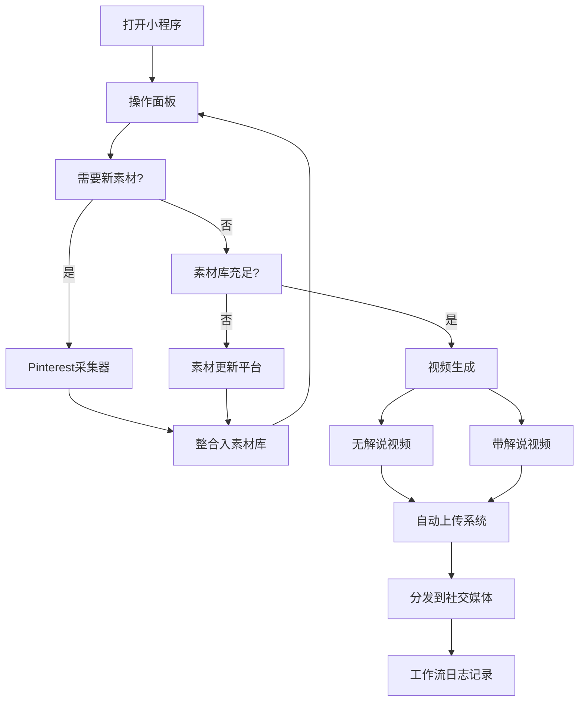

# 视频工作流执行系统 - 产品需求文档

## 1. 产品概述

视频工作流执行系统是一款面向内容创作者的微信小程序，用于自动化管理视频创作全流程。系统涵盖素材库更新、Pinterest图片爬取、视频生成（无解说/带解说）、以及社交媒体自动上传等功能，帮助创作者高效产出和分发视频内容。

目标用户：短视频创作者、自媒体运营者、内容营销团队。

## 2. 核心功能

### 2.1 功能模块

1. **操作面板（首页）**：展示素材统计、素材更新、视频生成入口
2. **Pinterest采集器**：爬取Pinterest图片素材并整合入素材库
3. **素材库管理**：查看、筛选、管理所有素材资源
4. **视频生成**：生成无解说视频和带解说视频
5. **自动上传系统**：配置和触发社交媒体自动上传
6. **工作流日志**：查看所有操作记录和执行状态

### 2.2 页面详情

| 页面名称 | 模块名称 | 功能描述 |
|---------|---------|---------|
| 操作面板 | 统计卡片 | 展示总素材数、可用素材、音频素材数量 |
| 操作面板 | 素材更新区 | 选择平台（Pinterest/Unsplash等），点击更新素材 |
| 操作面板 | 视频生成区 | 选择视频风格，生成无解说/带解说视频 |
| Pinterest采集器 | 搜索配置 | 输入查询词、爬取数量、筛选条件（like/save/comments） |
| 素材库 | 素材列表 | 网格展示图片/视频/音频素材，支持分类筛选 |
| 视频生成 | 风格选择 | 选择视频模板风格、背景音乐、时长配置 |
| 自动上传 | 平台配置 | 配置抖音/快手/小红书等平台的上传参数 |
| 工作流日志 | 执行记录 | 列表展示所有工作流的执行状态和结果 |

## 3. 核心流程

用户进入小程序后，首先看到操作面板，可查看当前素材统计。需要新素材时，可进入Pinterest采集器爬取图片，或选择素材更新平台一键更新。素材准备就绪后，选择视频风格生成视频（支持无解说和带解说两种模式）。视频生成完成后，可通过自动上传系统分发到各社交媒体平台。所有操作均记录在工作流日志中。

## 4. 用户界面设计

### 4.1 设计风格

- **主色调**：浅蓝色系（#E8F4FD背景，#1A73E8主色，#34A853成功色）
- **辅助色**：暖橙色（#FF8C42）用于强调按钮，灰色（#5F6368）用于次要文字
- **按钮样式**：圆角矩形（border-radius: 24rpx），主按钮使用蓝色渐变，次要按钮使用浅色背景
- **字体**：系统默认字体，标题使用加粗（font-weight: 600）
- **布局风格**：卡片式布局，圆角卡片（border-radius: 20rpx），柔和阴影
- **图标风格**：线性图标，简洁明了

### 4.2 页面设计概述

| 页面 | 模块 | UI元素 |
|-----|------|--------|
| 操作面板 | 顶部标题区 | 头像+"操作面板"标题，浅蓝背景 |
| 操作面板 | Banner区 | "视频工作流"艺术字+水墨画风格插画 |
| 操作面板 | 统计卡片 | 三个圆角卡片横向排列，显示数字+标签 |
| 操作面板 | 素材更新区 | 下拉选择器+橙色更新按钮 |
| 操作面板 | 视频生成区 | 下拉选择器+蓝色主按钮+橙色次按钮 |
| Pinterest采集器 | 顶部标题 | 头像+"pinterest采集器"标题 |
| Pinterest采集器 | 输入区 | 查询词输入框+数量输入框 |
| Pinterest采集器 | 筛选区 | like/save/comments三个筛选按钮 |
| Pinterest采集器 | 提交按钮 | 灰色圆角提交按钮 |

### 4.3 响应式设计

- 基于微信小程序原生框架，适配各种手机屏幕尺寸
- 使用rpx单位确保在不同设备上的比例一致
- 底部安全区适配（iPhone刘海屏等）

## 5. 动画与交互

- 页面切换使用微信小程序原生滑动动画
- 按钮点击态：缩放0.95+透明度变化
- 卡片hover效果：轻微上浮+阴影加深
- 数据加载：骨架屏+脉冲动画
- 操作成功：Toast提示+轻微震动反馈
