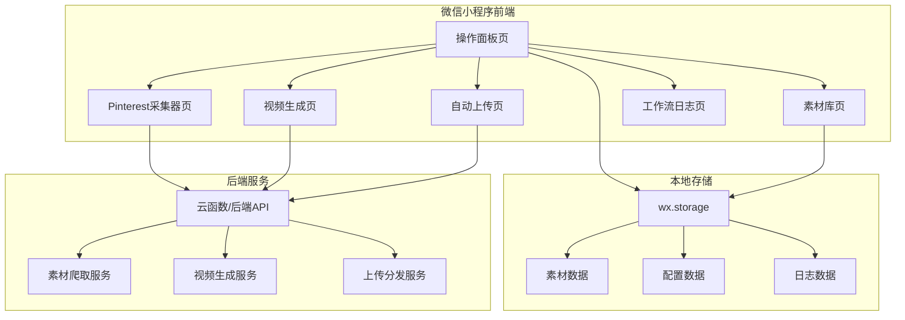

# 视频工作流执行系统 - 技术架构文档

## 1. 架构设计



## 2. 技术描述

- **前端框架**：微信小程序原生框架（WXML + WXSS + TypeScript）
- **UI组件**：微信小程序原生组件 + 自定义组件
- **状态管理**：基于App.globalData + 页面data管理
- **本地存储**：wx.setStorageSync / wx.getStorageSync
- **网络请求**：wx.request（与后端API通信）
- **后端服务**：云函数或RESTful API（素材爬取、视频生成、上传分发）

## 3. 路由定义

| 页面路径 | 用途 |
|---------|------|
| pages/index/index | 操作面板首页 |
| pages/crawler/crawler | Pinterest采集器 |
| pages/material/material | 素材库管理 |
| pages/video/video | 视频生成 |
| pages/upload/upload | 自动上传系统 |
| pages/logs/logs | 工作流日志 |

## 4. 数据结构

### 4.1 素材数据模型

```typescript
interface Material {
  id: string;
  type: 'image' | 'video' | 'audio';
  url: string;
  thumbnail?: string;
  title: string;
  tags: string[];
  source: string;
  status: 'available' | 'used' | 'processing';
  createdAt: number;
  metadata?: {
    width?: number;
    height?: number;
    duration?: number;
    size?: number;
  };
}
```

### 4.2 视频生成任务模型

```typescript
interface VideoTask {
  id: string;
  style: string;
  type: 'no-narration' | 'with-narration';
  materials: string[];
  bgm?: string;
  status: 'pending' | 'processing' | 'completed' | 'failed';
  progress: number;
  outputUrl?: string;
  createdAt: number;
  completedAt?: number;
}
```

### 4.3 上传任务模型

```typescript
interface UploadTask {
  id: string;
  videoId: string;
  platforms: string[];
  status: 'pending' | 'uploading' | 'completed' | 'failed';
  progress: Record<string, number>;
  results?: Record<string, { url?: string; status: string }>;
  createdAt: number;
}
```

### 4.4 工作流日志模型

```typescript
interface WorkflowLog {
  id: string;
  type: 'crawler' | 'material-update' | 'video-generate' | 'upload';
  status: 'success' | 'failed' | 'processing';
  message: string;
  details?: any;
  createdAt: number;
}
```

## 5. 组件设计

### 5.1 公共组件

| 组件名 | 用途 | 位置 |
|-------|------|------|
| navigation-bar | 自定义导航栏 | components/navigation-bar |
| stat-card | 统计数字卡片 | components/stat-card |
| material-card | 素材展示卡片 | components/material-card |
| action-button | 操作按钮（主/次） | components/action-button |
| log-item | 日志列表项 | components/log-item |
| empty-state | 空状态展示 | components/empty-state |

## 6. 接口设计

### 6.1 素材相关接口

| 接口 | 方法 | 描述 |
|-----|------|------|
| /api/materials | GET | 获取素材列表 |
| /api/materials | POST | 添加素材 |
| /api/materials/:id | DELETE | 删除素材 |
| /api/materials/stats | GET | 获取素材统计 |

### 6.2 爬取相关接口

| 接口 | 方法 | 描述 |
|-----|------|------|
| /api/crawler/pinterest | POST | 启动Pinterest爬取 |
| /api/crawler/status/:id | GET | 查询爬取状态 |

### 6.3 视频生成接口

| 接口 | 方法 | 描述 |
|-----|------|------|
| /api/video/generate | POST | 生成视频 |
| /api/video/status/:id | GET | 查询生成状态 |
| /api/video/styles | GET | 获取视频风格列表 |

### 6.4 上传接口

| 接口 | 方法 | 描述 |
|-----|------|------|
| /api/upload | POST | 上传视频到平台 |
| /api/upload/status/:id | GET | 查询上传状态 |
| /api/platforms | GET | 获取支持的平台列表 |
